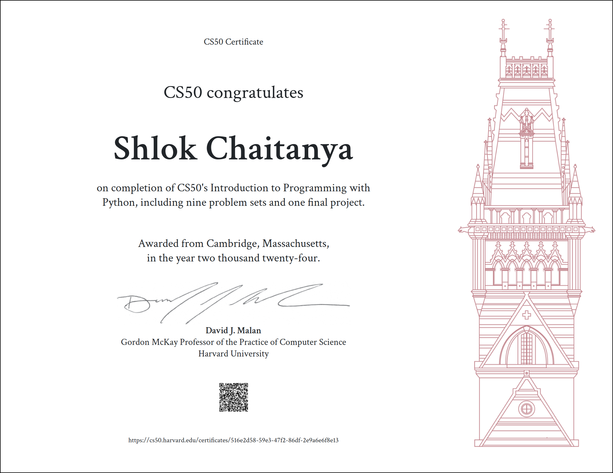

# CS50’s Introduction to Programming with Python

## Important Note: Academic Honesty Policy
Please do not try to submit my answers as your own.

>Note that CS50’s staff audits submissions to CS50P. Students found to be in violation of the Academic Honesty policy will be removed from the course and deemed ineligible for a certificate.

 

## Table of Contents
### [Week 0](/Week0/) - [Functions, Variables](https://cs50.harvard.edu/python/2022/weeks/0/)
- [Indoor Voice](/Week0/indoor/)
- [Playback Speed](/Week0/playback/)
- [Making Faces](/Week0/faces/)
- [Einstein](/Week0/einstein/)
- [Tip Calculator](/Week0/tip/)

### [Week 1](/Week1/) - [Conditionals](https://cs50.harvard.edu/python/2022/weeks/1/)
- [Deep Thought](/Week1/deep/)
- [Home Federal Savings Bank](/Week1/bank/)
- [File Extensions](/Week1/extensions/)
- [Math Interpreter](/Week1/interpreter/)
- [Meal Time](/Week1/meal/)

### [Week 2](/Week2/) - [Loops](https://cs50.harvard.edu/python/2022/weeks/2/)
- [camelCase](/Week2/camel/)
- [Coke Machine](/Week2/coke/)
- [Just setting up my twttr](/Week2/twttr/)
- [Vanity Plates](/Week2/plates/)
- [Nutrition Facts](/Week2/nutrition/)

### [Week 3](/Week3/) - [Exceptions](https://cs50.harvard.edu/python/2022/weeks/3/)
- [Fuel Gauge](/Week3/fuel/)
- [Felipe's Taqueria](/Week3/taqueria/)
- [Grocery List](/Week3/grocery/)
- [Outdated](/Week3/outdated/)

### [Week 4](/Week4/) - [Libraries](https://cs50.harvard.edu/python/2022/weeks/4/)
- [Emojize](/Week4/emojize/)
- [Frank, Ian and Glen's Letters](/Week4/figlet/)
- [Adieu, Adieu](/Week4/adieu/)
- [Guessing Game](/Week4/game/)
- [Little Professor](/Week4/professor/)
- [Bitcoin Price Index](/Week4/bitcoin/)

### [Week 5](/Week5/) - [Unit Tests](https://cs50.harvard.edu/python/2022/weeks/5/)
- [Testing my twttr](/Week5/test_twttr/)
- [Back to the Bank](/Week5/test_bank/)
- [Re-requesting a Vanity Plate](/Week5/test_plates/)
- [Refueling](/Week5/test_fuel/)

### [Week 6](/Week6/) - [File I/O](https://cs50.harvard.edu/python/2022/weeks/6/)
- [Lines of Code](/Week6/lines/)
- [Pizza Py](/Week6/pizza/)
- [Scourgify](/Week6/scourgify/)
- [CS50 P-Shirt](/Week6/shirt/)

### [Week 7](/Week7/) - [Regular Expressions](https://cs50.harvard.edu/python/2022/weeks/7/)
- [NUMB3RS](/Week7/numb3rs/)
- [Watch on YouTube](/Week7/watch/)
- [Working 9 to 5](/Week7/working/)
- [Regular, um, Expressions](/Week7/um/)
- [Response Validation](/Week7/response/)

### [Week 8](/Week8/) - [Object-Oriented Programming](https://cs50.harvard.edu/python/2022/weeks/8)
- [Seasons of Love](/Week8/seasons/)
- [Cookie Jar](/Week8/jar/)
- [CS50 Shirtificate](/Week8/shirtificate/)